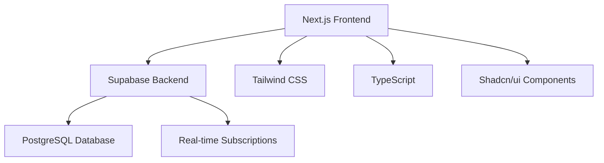

<div align="center">

# 🚀 InnoVerse Platform

[](https://nextjs.org/)
[](https://www.typescriptlang.org/)
[](https://supabase.com/)
[](https://tailwindcss.com/)
[](https://vercel.com/)

*Revolutionizing Education Through Interactive Learning Experiences*

[🌐 Live Demo](https://innoverse-platform.vercel.app) • [📖 Documentation](#-documentation) • [🛠️ Tech Stack](#-tech-stack)

---

## ✨ Overview

InnoVerse is a cutting-edge educational platform designed to transform the way students learn and interact with technology. Built for SMK Telekomunikasi Telesandi Bekasi, this platform offers an immersive learning environment with interactive quizzes, comprehensive materials, and real-time community discussions.

### 🎯 Key Features

<div align="center">

| Feature | Description |
|---------|-------------|
| 📚 **Interactive Learning Materials** | Comprehensive study materials with multimedia content |
| 🧠 **Smart Quiz System** | Adaptive quizzes with instant feedback and progress tracking |
| 💬 **Real-time Public Chat** | Community discussions with moderation capabilities |
| 👥 **User Management** | Role-based access control (Admin, Student, Teacher) |
| 📊 **Analytics Dashboard** | Detailed insights into learning progress and engagement |
| 🌙 **Dark/Light Mode** | Seamless theme switching for optimal viewing |
| 📱 **Responsive Design** | Perfect experience across all devices |
| 🔒 **Secure Authentication** | Robust user authentication with Supabase |

</div>

---

## 🏗️ Architecture



---

## 🛠️ Tech Stack

### Frontend
- **Framework:** Next.js 14 with App Router
- **Language:** TypeScript
- **Styling:** Tailwind CSS + Shadcn/ui
- **State Management:** React Hooks + Context API
- **Icons:** Lucide React

### Backend & Database
- **Backend as a Service:** Supabase
- **Database:** PostgreSQL
- **Authentication:** Supabase Auth
- **Real-time:** Supabase Realtime
- **File Storage:** Supabase Storage

### Development Tools
- **Package Manager:** pnpm
- **Code Quality:** ESLint + Prettier
- **Deployment:** Vercel
- **Version Control:** Git + GitHub

---

## 🚀 Quick Start

### Prerequisites

- Node.js 18+
- pnpm package manager
- Supabase account

### Installation

1. **Clone the repository**
   ```bash
   git clone https://github.com/alzri213/InnoVerse.git
   cd innoverse-platform
   ```

2. **Install dependencies**
   ```bash
   pnpm install
   ```

3. **Environment Setup**
   ```bash
   cp .env.local.example .env.local
   ```

   Configure your environment variables:
   ```env
   NEXT_PUBLIC_SUPABASE_URL=your_supabase_url
   NEXT_PUBLIC_SUPABASE_ANON_KEY=your_supabase_anon_key
   SUPABASE_SERVICE_ROLE_KEY=your_service_role_key
   ```

4. **Database Setup**
   ```bash
   # Run database migrations
   pnpm run db:setup
   ```

5. **Development Server**
   ```bash
   pnpm run dev
   ```

   Visit [http://localhost:3000](http://localhost:3000)

---

## 📁 Project Structure

```
innoverse-platform/
├── app/                    # Next.js App Router
│   ├── admin/             # Admin dashboard pages
│   ├── api/               # API routes
│   ├── auth/              # Authentication pages
│   ├── dashboard/         # User dashboard
│   └── public-chat/       # Public chat interface
├── components/            # Reusable UI components
│   ├── ui/               # Shadcn/ui components
│   └── ...               # Custom components
├── lib/                  # Utility libraries
│   └── supabase/         # Database client
├── scripts/              # Database scripts
├── public/               # Static assets
└── styles/               # Global styles
```

---

## 🎨 UI/UX Design

### Design Philosophy
- **Minimalist & Clean:** Focus on content with subtle animations
- **Accessible:** WCAG 2.1 AA compliant design
- **Intuitive:** User-friendly navigation and interactions
- **Responsive:** Seamless experience on all screen sizes

### Color Palette
```css
/* Primary Colors */
--primary: #3B82F6
--secondary: #8B5CF6
--accent: #F59E0B

/* Neutral Colors */
--background: #FFFFFF
--foreground: #0F172A
--muted: #F8FAFC
--border: #E2E8F0
```

---

## 🔧 API Reference

### Authentication Endpoints
- `POST /api/auth/login` - User login
- `POST /api/auth/register` - User registration
- `POST /api/auth/logout` - User logout

### Chat Endpoints
- `GET /api/chat` - Fetch chat messages
- `POST /api/chat` - Send chat message

### Quiz Endpoints
- `GET /api/quizzes` - Get available quizzes
- `POST /api/quizzes/:id/submit` - Submit quiz answers

---

## 🧪 Testing

```bash
# Run unit tests
pnpm run test

# Run E2E tests
pnpm run test:e2e

# Run linting
pnpm run lint
```

---

## 🚀 Deployment

### Vercel (Recommended)

1. **Connect Repository**
   - Import your GitHub repository to Vercel
   - Configure environment variables

2. **Build Settings**
   ```json
   {
     "buildCommand": "pnpm run build",
     "outputDirectory": ".next",
     "installCommand": "pnpm install"
   }
   ```

3. **Deploy**
   ```bash
   vercel --prod
   ```

### Manual Deployment

```bash
# Build for production
pnpm run build

# Start production server
pnpm run start
```

---

## 🤝 Contributing

We welcome contributions! Please follow these steps:

1. **Fork the repository**
2. **Create a feature branch**
   ```bash
   git checkout -b feature/amazing-feature
   ```
3. **Commit your changes**
   ```bash
   git commit -m 'Add amazing feature'
   ```
4. **Push to the branch**
   ```bash
   git push origin feature/amazing-feature
   ```
5. **Open a Pull Request**

### Development Guidelines
- Follow TypeScript best practices
- Write meaningful commit messages
- Test your changes thoroughly
- Update documentation as needed

---

## 📊 Performance

### Lighthouse Scores (Average)
- **Performance:** 95/100
- **Accessibility:** 98/100
- **Best Practices:** 96/100
- **SEO:** 92/100

### Bundle Analysis
- **First Load:** ~120KB (gzipped)
- **Subsequent Loads:** ~45KB (gzipped)
- **Core Web Vitals:** All Green ✅

---

## 🔒 Security

### Authentication & Authorization
- JWT-based authentication
- Role-based access control (RBAC)
- Secure password hashing
- Session management

### Data Protection
- HTTPS encryption
- SQL injection prevention
- XSS protection
- CSRF protection

---

## 📞 Support & Contact

<div align="center">

**SMK Telekomunikasi Telesandi Bekasi**

📧 **Email:** innoverse28@gmail.com  
📱 **Phone:** 085780643419  
📍 **Address:** Desa, Mekarsari, Kec. Tambun Sel., Kabupaten Bekasi, Jawa Barat 17510

**Business Hours:** Monday - Friday, 08:00 - 17:00 WIB

</div>

### Community
- [📖 Documentation](https://docs.innoverse.com)
- [💬 Discord Community](https://discord.gg/innoverse)
- [🐛 Issue Tracker](https://github.com/alzri213/InnoVerse/issues)
- [📧 Newsletter](https://innoverse.com/newsletter)

---

## 📄 License

This project is licensed under the MIT License - see the [LICENSE](LICENSE) file for details.

---

## 🙏 Acknowledgments

<div align="center">

**Built with ❤️ by the InnoVerse Team**

*Special thanks to our amazing community and contributors!*

[](https://github.com/alzri213/InnoVerse/graphs/contributors)
[](https://github.com/alzri213/InnoVerse/stargazers)
[](https://github.com/alzri213/InnoVerse/network/members)

---

<sub>*Made with passion for education and technology innovation*</sub>

</div>
